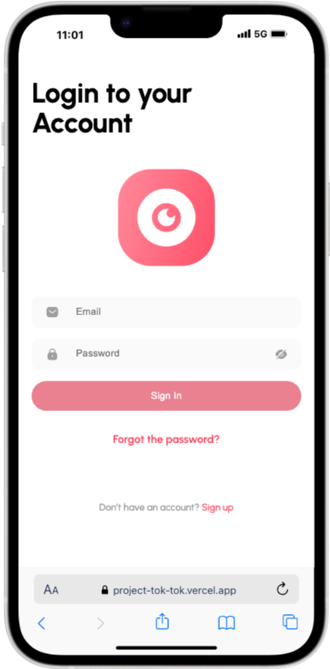
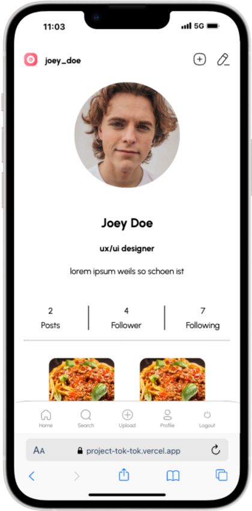
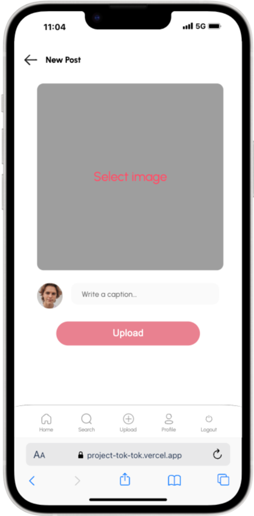

# TokTok

TokTok is a social media platform developed specifically for young professionals. It enables users to network, share content and be inspired.

## About this project

TokTok is the final project of our 6-month web developer bootcamp. In this project we were able to use our newly acquired skills in React, TypeScript and Supabase to develop a fully functional social media platform.

With a lot of joy and commitment, we realized the technical implementation of TokTok and learned a lot in the process. From planning and conception to development and deployment, we went through all the phases of a real project and were able to put our knowledge into practice.

We are particularly proud of the fact that we have created a mobile-first application that is specifically tailored to the needs of young professionals and successfully implements a given design.

## Vision

Although TokTok is already a fully functional social media platform, we would have liked to implement a few more ideas. <br>
Potential enhancements could be:

- **Replying to comments:** Allows users to reply directly to comments and thus structure discussions.
- **Messaging feature:** Allows users to send private messages to other users.

## Features

**Profile management:** Create and edit your profile with information about yourself and your professional interests.

**Create posts:** Share your thoughts, ideas and experiences in the form of image posts with text.

**Interact:** Respond to posts with likes and comments and exchange ideas with other users.

**Network:** Follow other users to see their posts in your feed and see who you follow and who follows you.

**Mobile-First:** TokTok is optimized for use on mobile devices and offers a seamless experience on smartphones and tablets.

## Technologies

**Frontend:**

[](#)
[](#)
[](#)

**Backend:**

[](#)

**Tools:**

[](#)
[](#)

[](#)
[](#)
[](#)

**Organization**

[](#)
[](#)

## Installation

TokTok is a web application and requires no installation. Just visit the website in your browser.

[Explore TokTok](https://project-tok-tok.vercel.app/)

You can either create your own account, or login with our Testuser Joey Doe.

email: testuser@example.com
<br>

## Usage

1 **Create an account:** Register with your e-mail address and a password.

2 **Create profile:** Fill your profile with relevant information and a profile picture.

3 **Create posts:** Share your thoughts, pictures and ideas with other users.

4 **Interact:** Like and comment on other users' posts.

5 **Network:** Follow other users to see their content in your feed.

## Screenshots

<table align="center">
  <tr>
    <td></td>
    <td></td>
    <td></td>
  </tr>
</table>

## Access to TokTok

To run TokTok on your local computer, follow these steps:

1. **Clone this repository:**

   ```bash
   git clone https://github.com/ChrstianH/Project_TokTok.git
   ```

2. **Install dependencies:**
   Install the frontend dependencies by running:

   ```bash
   npm install
   ```

3. **Start the app:**
   Run the following command to start the application:
   ```bash
   npm run dev
   ```

## License

This project is licensed under the MIT License.

The MIT License is a permissive free software license that allows you to use, copy, modify, merge, publish, distribute, sublicense, and/or sell copies of the software. It also allows others to do the same.

## Project Members - github Pages

[Christian Henschel](https://github.com/ChrstianH)

[Nana Leven](https://github.com/Nana7782)

[Ahmed San](https://github.com/snahmd)
